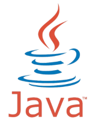

# namespace-config-controller

A controller for Openshift to apply namespace settings, which cannot be set by
Helm (namespace annotations+labels and netnamespace multicast configuration)

# Writing a Kubernetes Operator in Java

*(c) People of India Photos*

## Introduction

At [my current work](https://bankdata.dk/), we use a home-made GitOps approach for configuring namespaces in our multi-tenant Openshift 
clusters. The approach is based on using Helm for configuring each namespace, with features such as ensuring
rolebindings for the users who needs access to the namespace, setting up service accounts and services to interact 
with other self-services, and for ensuring the correct policies are in place on the namespace.

While this works great, Helm is good for provisioning stuff inside namespaces, but not for provisioning the
namespace itself. In Openshift, this is the same for other objects that co-exist with the namespace, such as
the Netnamespace. For this purpose the workaroud we came up with, is a post-namespace creation process, which
updates the Namespace and Netnamespace objects from a "shadow" NamespaceConfig object inside the Namespace.

This calls for an operator (CRD + controller), and since my workplace is mostly a Java workshop, what better
than try to implement the controller in Java.

### Java libraries for Kubernetes/Openshift

There are two widely used Java libraries for interacting with Kubernetes:

* https://github.com/kubernetes-client/java -- Official Java client library for kubernetes, provided by the Kubernetes
  project itself.
* https://github.com/fabric8io/kubernetes-client -- Fabric8io's implementation of a Java client library for the 
  Kubernetes and Openshift API.
  
The official Kubernetes client is autogenerated and is very true to the API, but, working with it feels like
working with a REST client and not very integrated. Fabric8io's client offers a more high-level API on top of
the plain REST interface, and apart from plain Kubernetes, it also supports Openshift's API, so for this
exercise I'm going with the Fabric8io client library.

### Controllers in Java

The responsibility of the controller is to be on top of changes to objects of certain types inside the cluster. 
Once changes appear to the objects, the controller needs to make its reconcilating action.

A very common strategy for staying on top of changes is these three steps:
* Watch for create/update/delete events for the type.
* Periodically poll all objects of the type.
* Keep an internal cache to track object state in order to provide old/new versions on updates.

Using the fabric8io library, we can chose to implement it outselves, or, we can use the SharedInformer
which does all of the above for us, thus simplifying our part of the code.

### Custom resource definitions (CRDs) in Java

As mentioned above, what makes an operator in Kubernetes, is the combination of a CRD, and a supporting
controller for the CRD. Writing controllers for standardized Kubernetes objects, for example writing a 
controller that watches changes to secrets, and kills pods that references a changed secret, does not require
any CRD handling in the controller, as everything is already supported in the java library.

In Fabric8io's Java library, there is support for dealing with CRDs. In order to work with CRDs the following needs
to be done:
* Write the CRD (not Java related)
* Write Java classes that map the CRD (currently there is no generation support for this like in Go).
* Register the CRD classes with the KubernetesDeserializer, so the client library understands mapping them from JSON to Java.
* Create a Java client for the CRD.

Once this is done, working with CRD defined objects, is the same as working with regular objects in the library.

